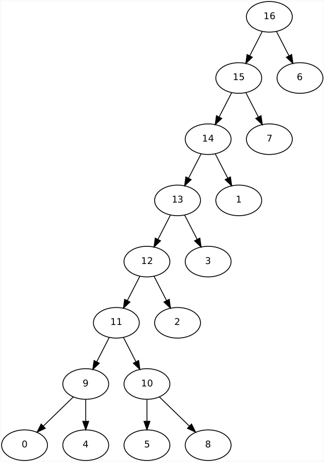

# Binary Partition Tree Value Set (BPTV)

This repository contains the code for the paper *New algorithms for multivalued component-trees* by Nicolas Passat, Romain Perrin, Jimmy Francky Randrianasoa, Camille Kurtz, and Benoît Naegel. 

## Dependencies

The code is written in Java (Eclipse project) and requires the following library:

- <a href="https://github.com/yonmi/BinaryPartitionTree.git" target="_blank">BinaryPartitionTree</a>

## Usage

- Import the project on Eclipse (or transform it into another type of project)
- Run the `Main.java` of the package `src/bptv`

This will run the code on the image depicted on <b>Figure 6</b> of the paper and output a hierarchical order on an enriched set of values.

The `bpt_labels_fig6.dot` has been built as described in the <b>Section 5.2: Ordering the enriched value set</b> of the paper.

See <a href="https://github.com/bnaegel/multivalued_component_tree.git" target="_blank">multivalued_component_tree</a> to see the usefulness of such hierarchical ordered set.

The hierarchical ordered set can be visualized using for example the command:
```bash
dot -Tpdf bpt_labels_fig6.dot -o bpt_labels_fig6.pdf
```
which produces a graphical representation of the tree in pdf format or using any tiers software that can read dot files.


<b>(a) Top: the image. Bottom: set of 9 values. (b) Top: the co-occurrence matrix of the image. Bottom: the set is endowed with an adjacency. (c) Binary partition tree as a hierarchical order on an enriched set of values.</b>



<b>The produced hierarchical ordered value set is a BPT built by using the proposed algorithm.</b>

Each node is described by he value of the  node, represented by an integer index based on the following mapping :

  -  &nbsp; 0: &nbsp; 9
  -  &nbsp; 1: &nbsp; 0 &nbsp;&nbsp;&nbsp;(as blue)
  -  &nbsp; 2: &nbsp; 4 &nbsp;&nbsp;&nbsp;(as gray)
  -  &nbsp; 3: 10
  -  &nbsp; 4: &nbsp; 5 &nbsp;&nbsp;&nbsp;(as cyan)
  -  &nbsp; 5: &nbsp; 8 &nbsp;&nbsp;&nbsp;(as yellow)
  -  &nbsp; 6: 11
  -  &nbsp; 7: 12
  -  &nbsp; 8: &nbsp; 2 &nbsp;&nbsp;&nbsp;(as green)
  -  &nbsp; 9: 13
  - 10: &nbsp; 3 &nbsp;&nbsp;&nbsp;(as fuchsia)
  - 11: 14
  - 12: &nbsp; 1 &nbsp;&nbsp;&nbsp;(as light blue)
  - 13: 15
  - 14: &nbsp; 7 &nbsp;&nbsp;&nbsp;(as orange)
  - 15: 16
  - 16: &nbsp; 6 &nbsp;&nbsp;&nbsp;(as red)